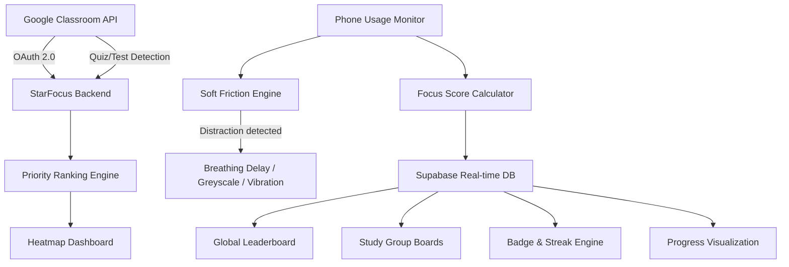

# Proposed Solution Architecture

> **StarFocus — A Three-Phase Student Productivity Platform**

---

## 1. Executive Summary

**StarFocus** is a three-phase student productivity platform designed around three psychological primitives: *awareness*, *protection*, and *motivation*. The system integrates academic task intelligence, context-aware distraction management, and social accountability into a unified platform that operates within the student's existing academic ecosystem.

---

## 2. High-Level System Overview

```
┌────────────────────────────────────────────────────────────────────┐
│  🛰️  PHASE 1 — THE BRAIN (Awareness & Ranking Engine)            │
│  Psychological Primitive: COGNITIVE OFFLOADING                     │
│  Goal: "Know WHAT to do"                                           │
│  ┌───────────────────┐  ┌────────────────┐  ┌───────────────────┐  │
│  │ Google Classroom   │→ │ Quiz & Task    │→ │ Priority Ranking   │  │
│  │ API Sync (OAuth)   │  │ Parser         │  │ Engine             │  │
│  └───────────────────┘  └────────────────┘  └───────────────────┘  │
├────────────────────────────────────────────────────────────────────┤
│  ⚡ PHASE 2 — THE SHIELD (Focus Execution System)                  │
│  Psychological Primitive: ENVIRONMENTAL DESIGN                     │
│  Goal: "STAY focused while doing it"                               │
│  ┌───────────────────┐  ┌────────────────┐  ┌───────────────────┐  │
│  │ App Usage Monitor  │→ │ Soft Friction  │→ │ Focus Score         │  │
│  │ (OS-level)         │  │ + Vibration    │  │ Calculator          │  │
│  └───────────────────┘  └────────────────┘  └───────────────────┘  │
├────────────────────────────────────────────────────────────────────┤
│  🏆 PHASE 3 — THE HOOK (Social Motivation Layer)                   │
│  Psychological Primitive: SOCIAL ACCOUNTABILITY                    │
│  Goal: "Be MOTIVATED to keep going"                                │
│  ┌───────────────────┐  ┌────────────────┐  ┌───────────────────┐  │
│  │ Global + Group     │→ │ Progress Viz   │→ │ Badges & Streaks    │  │
│  │ Leaderboards       │  │ (Strava-style) │  │                     │  │
│  └───────────────────┘  └────────────────┘  └───────────────────┘  │
└────────────────────────────────────────────────────────────────────┘
```

### Design Philosophy

| Principle | Description |
|-----------|-------------|
| **Friction, not blocking** | We add *cost* to distraction loops, not walls. Walls create resentment; friction creates reflection. |
| **Intelligence over discipline** | The system makes smart decisions so the student doesn't have to. |
| **Social motivation over punishment** | Leaderboards and badges reward focus rather than punishing distraction. |
| **Zero-entry-barrier** | Google Classroom sync means no manual data entry to get started. |
| **Privacy-first** | All usage monitoring happens on-device; only aggregated scores are shared. |

---

## 3. Phase 1 — The Awareness & Ranking Engine ("The Brain")

### 3.1 Google Classroom API Integration

**Authentication:** OAuth 2.0 with PKCE for mobile. Required scopes: `classroom.courses.readonly`, `classroom.coursework.me.readonly`, `classroom.student-submissions.me.readonly`. Tokens stored in secure device keychain.

**Sync Strategy:** Full sync on first login → incremental delta sync every 30 minutes.

**Data Extracted:**

| Field | Source | Usage |
|-------|--------|-------|
| Course Name & ID | `courses.list()` | Course categorization |
| Assignment Title & Description | `courseWork.list()` | Task display |
| Due Date & Time | `courseWork.list()` | Time remaining calculation |
| Grade Weightage | User input / syllabus parsing | Priority formula input |
| Submission Status | `studentSubmissions.list()` | Hide completed tasks |
| Quiz/Test Metadata | `courseWork.list()` (type filter) | Quiz detection + urgency escalation |

### 3.2 Quiz & Assessment Parsing (NEW)

The ingestion engine now detects and specially handles quizzes, tests, and graded assessments from Google Classroom:

**Parsing Targets:**

| Field | Extraction Method | Usage |
|-------|------------------|-------|
| Due Date | Direct from API | Time remaining calculation |
| Duration / Time Limit | Parsed from description or quiz settings | Urgency weighting |
| Grade Weightage | User input or syllabus | Priority formula input |
| Attempt Limits | Parsed from quiz settings | Flags single-attempt assessments as higher priority |
| Type | `courseWork.workType` field | Differentiates ASSIGNMENT vs SHORT_ANSWER_QUESTION vs MULTIPLE_CHOICE |

**Priority Ranking Updates for Quizzes:**
- Quizzes receive a **higher urgency weight** (1.5× multiplier on base priority) because they are typically time-bound and non-extendable
- **Time-bound priority escalation:** quizzes with < 24 hours remaining automatically enter 🔴 Red zone regardless of grade weightage
- Single-attempt quizzes receive an additional **1.2× multiplier** since they cannot be re-submitted

### 3.3 Manual Task Entry (Clubs, Extracurriculars & Personal)

Not all student obligations live on Google Classroom. Students can **manually add tasks** for club activities, personal projects, event planning, competitive programming, sports, and any other commitments.

**User-Entered Fields:**

| Field | Input Type | Description |
|-------|-----------|-------------|
| **Task Name** | Free text | e.g., "IEEE Hackathon Prep", "Dance Practice", "GRE Verbal" |
| **Deadline** | Date & Time picker | When the task is due or the event occurs |
| **Priority Score** | Manual slider (1–10) | User sets how important this task is relative to other work |
| **Category** | Dropdown | Club / Extracurricular / Personal / Exam Prep / Other |
| **Completion %** | Slider (0–100%) | Same as Classroom tasks — self-reported progress |

**How Manual Tasks Integrate with the System:**
- Manual tasks appear on the **Heatmap Dashboard** alongside Classroom tasks, with a distinct icon (📌) to differentiate them
- The user-set priority score is **normalized to the same 0–1 scale** as the auto-calculated priority for Classroom tasks
- Manual tasks contribute to the **Workload Score** just like Classroom-synced tasks
- Focus Sprints can be linked to manual tasks, and time spent on them counts toward the **Focus Score**
- Manual tasks also affect **streak tracking** and **leaderboard rankings** (focus time is focus time, regardless of source)

### 3.4 Priority-Weighted Deadline Engine

**The Priority Formula:**

$$
Priority = \frac{Grade\ Weightage \times (1 - Completion\%)}{Time\ Remaining} \times Quiz\ Prep\ Multiplier
$$

| Variable | Source | Scale |
|----------|--------|-------|
| Grade Weightage | Syllabus / user input | 0.0 – 1.0 |
| Completion % | Self-reported progress per assignment | 0% – 100% (higher completion = lower priority) |
| Time Remaining | `due_date - now()` in hours (floor = 1) | Continuous |
| Quiz Prep Multiplier | Auto-detected from task type | 1.0× (assignment) / 1.5× (quiz/test) / 1.8× (single-attempt quiz) |

> **Note:** Task Complexity has been removed — no LLM dependency is needed. The formula relies entirely on data from Google Classroom + user-reported completion %. For manual tasks, the user-set priority score replaces the auto-calculated formula.

**Priority Zones (after min-max normalization across tasks):**

| Zone | Range | UI Treatment |
|------|-------|-------------|
| 🔴 Red (Critical) | > 0.7 | Pulsing red card, top of dashboard, triggers Shield friction |
| 🟡 Amber (Warming) | 0.3 – 0.7 | Orange border, "Schedule Today" section |
| 🟢 Green (Stable) | < 0.3 | Subtle card, "Coming Up" section |

### 3.5 Workload Score (0–100)

The **Workload Score** aggregates all pending tasks (Classroom-synced **and** manually added) into a single number representing current academic pressure:

$$
Workload\ Score = \sum_{i=1}^{n} Priority_i \times (1 - Completion\%_i) \quad \text{(normalized to 0–100)}
$$

| Workload Level | Score Range | Meaning | Intervention Profile |
|:-------------:|:-----------:|----------|---------------------|
| 🟢 Low | 0 – 29 | Few or mostly-completed tasks; relaxed schedule | Default timers (1h / 2h / 3h) |
| 🟡 Moderate | 30 – 59 | Normal academic load; standard focus discipline needed | Moderate timers (0.75h / 1.5h / 2.25h) |
| 🔴 High | 60 – 100 | Heavy pending workload; aggressive focus protection needed | Aggressive timers (0.5h / 1h / 1.5h) |

The Workload Score directly controls the **intervention timer thresholds** in Phase 2 (The Shield). Higher workload = earlier and more aggressive friction.

### 3.6 Heatmap Dashboard

The student's command center — a visual representation of their academic landscape:

- **Workload Score** displayed prominently at the top (0–100 gauge)
- **Live Priority Bars** with real-time fill based on priority score
- **Completion % slider** on each task card for self-reporting progress
- **Color-Coded Cards** matching priority zones (assignments and quizzes distinguished by icon)
- **Time Countdown** with urgency-adaptive formatting
- **Quick Action:** "Start Focus Sprint" on every card
- **Course Filtering**, **Category Filtering** (Classroom / Manual), and **Weekly Calendar View** available
- **Quick Add (➕)** button to create manual tasks directly from the dashboard
- **Simple Guidance:** For any task, the app suggests the student **start by reading the assignment/quiz description** rather than generating micro-steps

---

## 4. Phase 2 — Focus Execution System ("The Shield")

### 4.1 App Usage Monitoring

| Platform | API | Capability |
|----------|-----|-----------|
| Android | `UsageStatsManager` + Accessibility Service | Full app usage, foreground detection, screen-on time |

**App Classification:** Productive (whitelisted) → Neutral (soft warnings) → Distracting (flagged) → Custom (user overrides)

All monitoring happens **on-device**. No raw usage data leaves the phone.

### 4.2 Workload-Adaptive Intervention System

Intervention timers **adapt based on the Workload Score**. When workload is high, friction kicks in earlier to protect the student's limited time.

**Default Timers (Low Workload — Score < 30):**

| Intervention | Trigger Time (on distracting app) | Action |
|-------------|:---------------------------------:|--------|
| 🟢 Breathing Exercise | After **1 hour** of cumulative distraction use | 5-second breathing overlay: *"Does this help finish [Task Name]?"* |
| 🟡 Greyscale Mode | After **2 hours** of cumulative distraction use | Strips color from distracting apps |
| 🔴 Continuous Vibration | After **3 hours** of cumulative distraction use | Full-screen overlay + continuous vibration; stops only when returning to focus app or holding override button |

**Moderate Timers (Moderate Workload — Score 30–59):**

| Intervention | Trigger Time (on distracting app) | Action |
|-------------|:---------------------------------:|--------|
| 🟢 Breathing Exercise | After **45 minutes** of cumulative distraction use | 5-second breathing overlay: *"You have pending tasks. Stay on track!"* |
| 🟡 Greyscale Mode | After **1.5 hours** of cumulative distraction use | Strips color from distracting apps |
| 🔴 Continuous Vibration | After **2.25 hours** of cumulative distraction use | Full-screen overlay + continuous vibration |

**Aggressive Timers (High Workload — Score ≥ 60):**

| Intervention | Trigger Time (on distracting app) | Action |
|-------------|:---------------------------------:|--------|
| 🟢 Breathing Exercise | After **30 minutes** of cumulative distraction use | 5-second breathing overlay: *"You have [X] tasks due. Focus up!"* |
| 🟡 Greyscale Mode | After **1 hour** of cumulative distraction use | Strips color from distracting apps |
| 🔴 Continuous Vibration | After **1.5 hours** of cumulative distraction use | Full-screen overlay + continuous vibration |

**Escalation Summary:**

| Stack Layer | Method | Low (< 30) | Moderate (30–59) | High (≥ 60) |
|:-----------:|--------|:----------:|:----------------:|:-----------:|
| Layer 1 | Breathing exercise | After 1 hr | After 0.75 hr | After 0.5 hr |
| Layer 2 | Greyscale mode | After 2 hr | After 1.5 hr | After 1 hr |
| Layer 3 | Continuous vibration + overlay | After 3 hr | After 2.25 hr | After 1.5 hr |

**Continuous Vibration Deterrent — Behavior Flow:**
1. Cumulative distraction time threshold exceeded during a calendar day
2. Full-screen overlay appears blocking the distraction app
3. Continuous vibration begins (`VibrationEffect.createWaveform()` with looping pattern)
4. Vibration stops **only if:**
   - User returns to the StarFocus/focus app, **or**
   - User holds an override button for 5 seconds (configurable)

**Android Implementation:**
- Detection: Accessibility Service + foreground app monitoring
- Vibration: `VibrationEffect.createWaveform()` with continuous pattern loop
- Overlay: `SYSTEM_ALERT_WINDOW` permission

**Impulse vs. Intent Detection:**
- < 15 sec usage = Impulse → Full friction
- Notification tap = Reactive → Layer 1 only
- > 2 min deliberate use = Intentional → Reduced friction

### 4.3 Focus Sprint Mode

Configurable timed deep work sessions (default 25 min Pomodoro):

| Parameter | Default | Options |
|-----------|---------|---------|
| Duration | 25 min | 15 / 25 / 45 / 60 / custom |
| Break | 5 min | 3 / 5 / 10 / custom |
| Linked task | Auto-highest priority | Manual override |
| Friction level | Maximum | Adjustable |

### 4.4 The Deep Work Focus Score

$$
Focus\ Score = \frac{Deep\ Work\ Minutes}{App\ Switches + Impulse\ Opens + 1}
$$

**Multipliers:**

| Condition | Multiplier |
|-----------|-----------|
| Working on 🔴 Red-priority task | 1.5× |
| Working on a quiz/assessment | 1.3× |
| Self-declared "Deep Work" hours | 1.1× |
| Zero flagged app opens during sprint | 1.3× |

**Daily Score** = Average of all session adjusted scores (rewards quality over quantity).

---

## 5. Phase 3 — Social Motivation Layer ("The Hook")

### 5.1 Global Leaderboard

**Purpose:** Creates broad competitive pressure, increases retention & engagement.

```
┌─────────────────────────────────────────────────────┐
│  🏆  GLOBAL FOCUS LEADERBOARD — This Week            │
├────┬──────────────────┬────────────┬─────────────────┤
│ #  │ Student          │ Focus Score │ Streak          │
├────┼──────────────────┼────────────┼─────────────────┤
│ 1  │ 🔥 FocusNinja42   │   92.1      │ 🔥 14-day        │
│ 2  │ DeepWorker       │   88.7      │ 🔥 9-day         │
│ 3  │ NightOwl_CS      │   85.3      │ 🔥 7-day         │
└────┴──────────────────┴────────────┴─────────────────┘
```

**Requirements:**
- **Opt-in toggle** (default OFF for privacy)
- **Anonymized display option** — students can use a nickname / avatar instead of real name
- **Ranking metrics:** weekly focus score, streak length, completed tasks
- **Weekly resets** every Monday to maintain engagement
- **Position change** push notifications

### 5.2 Study Groups (Private Competition)

**Purpose:** Creates controlled competition with higher adherence than global ranking alone.

**Functionality:**

| Feature | Description |
|---------|-------------|
| **Create Group** | Any student can create a study group with a name and optional description |
| **Invite via Link/Code** | Share a 6-character join code or shareable deep link |
| **Group Leaderboard** | View member rankings within the group (Focus Score, streaks, focus hours) |
| **Compare Metrics** | Side-by-side comparison of streaks & focus hours between group members |

**Group Ranking Logic:**

| Metric | Weight | Description |
|--------|:------:|-------------|
| Daily focus minutes | 40% | Total productive minutes logged |
| Streak consistency | 35% | Consecutive days meeting focus threshold |
| Assignment completion % | 25% | On-time completion rate from Classroom sync |

### 5.3 Progress Visualization (Strava-Style)

**Purpose:** Make focus effort visible and satisfying, similar to how Strava visualizes athletic performance.

**Data Tracked:**
- Daily focus minutes
- Task completion rate
- Weekly trends

**Visual Formats:**

| Chart Type | Data | Usage |
|------------|------|-------|
| **Line Trend** | Weekly focus score over time | Shows improvement trajectory |
| **Bar Chart** | Daily focus minutes (7-day view) | Shows daily consistency |
| **Calendar Heatmap** | Days with focus sessions (monthly) | Shows streak consistency at a glance (green intensity = focus hours) |

### 5.4 Streak System

**Purpose:** Reinforce habit formation through consecutive-day tracking.

| Feature | Description |
|---------|-------------|
| **Streak Counter** | Counts consecutive days where the student hits their focus threshold (configurable, default 30 min) |
| **Freeze Token** | Optional missed-day recovery — students earn 1 freeze token per 7-day streak, usable to preserve a streak on a missed day |
| **Visual Streak Display** | Flame icon with day count shown on profile and leaderboard |
| **Streak Milestones** | Special celebrations at 7, 14, 30, 60, and 100-day milestones |

### 5.5 Recognition & Badge System

| Badge | Name | Criteria |
|-------|------|----------|
| 🔥 | **Streak Master** | 7-day consecutive Focus Sprint streak |
| 👑 | **Comeback King** | Highest week-over-week improvement in study group |
| 🏅 | **Deep Diver** | 4+ hours uninterrupted deep work |
| 🌅 | **Early Bird** | 5 sprints before 8 AM in one week |
| 🤝 | **Team Player** | Top 3 study group contributor for 2+ consecutive weeks |
| ⚡ | **Sprint Queen/King** | 100 total Focus Sprints completed |
| 💎 | **Diamond Focus** | Weekly score ≥ 90 for 4 consecutive weeks |
| ❄️ | **Freeze Saver** | Used a freeze token and then maintained a 14+ day streak |

Badges appear on profile cards. Rare badges trigger campus-wide notifications.

---

## 6. Data Architecture

### 6.1 Database Schema (Supabase / PostgreSQL)

**Core Tables:** `users`, `tasks`, `focus_sessions`, `daily_scores`, `user_badges`, `leaderboard_snapshots`, `study_groups`, `group_members`, `streaks`

**Key Design Decisions:**
- **Row-Level Security (RLS)** ensures users can only access their own task and session data
- **Leaderboard/score data is public read** for social features
- **Real-time subscriptions** via Supabase channels for live leaderboard updates

### 6.2 Real-Time Data Flow



**Real-Time Channels:** `leaderboard:global` (opt-in scores), `leaderboard:group:{group_id}` (group scores), `tasks:{user_id}` (new assignments/quizzes), `badges:{user_id}` (new badges), `streaks:{user_id}` (streak updates).

---

## 7. Technology Stack

| Layer | Technology | Justification |
|-------|-----------|---------------|
| **Mobile App** | React Native + Expo | Hackathon-fast development; hot reload; Expo Go for instant on-device testing; single-command APK builds via EAS; excellent AI-assisted (vibe) coding support |
| **Backend + DB + Auth** | Supabase (PostgreSQL) | All-in-one: real-time subscriptions, RLS, OAuth 2.0 for Google sign-in, edge functions; generous free tier (500 MB DB, 50K MAU) |
| **Usage Monitoring** | Android Accessibility API + `UsageStatsManager` | OS-level foreground app tracking (via Expo bare workflow / native module) |
| **Vibration** | Android `VibrationEffect` API | Continuous deterrent waveform patterns (via native module) |
| **Overlay** | `SYSTEM_ALERT_WINDOW` permission | Full-screen overlay for vibration deterrent (via native module) |
| **Push Notifications** | Firebase Cloud Messaging | Free tier (10K messages/day); native Android integration via Expo |
| **Charting** | react-native-chart-kit / Victory Native | Strava-style progress visualizations; works with Expo |
| **Analytics** | PostHog | Funnel analysis, retention tracking; free tier (1M events/month) |
| **Distribution** | Direct APK sharing / Google Play Store | Hackathon: share APK directly ($0). Production: Play Store ($25 one-time) |

**Total Cost: $0** — all technologies operate within free tiers.

> **Native Module Note:** Usage monitoring, vibration waveforms, and overlay require Android-native code. These are implemented as Expo native modules (bare workflow) while the rest of the app uses standard Expo managed workflow for maximum development speed.

---

## 8. API Architecture

### REST Endpoints

**Tasks & Priority:**
| Method | Endpoint | Description |
|--------|---------|-------------|
| `GET` | `/api/tasks` | List all active tasks with priorities |
| `POST` | `/api/tasks` | Create manual task (clubs, extracurriculars, personal) |
| `POST` | `/api/tasks/sync` | Trigger Google Classroom sync (assignments + quizzes) |
| `PUT` | `/api/tasks/:id` | Update task metadata (weightage, completion %) |

**Focus Sessions:**
| Method | Endpoint | Description |
|--------|---------|-------------|
| `POST` | `/api/sessions/start` | Start a Focus Sprint |
| `PUT` | `/api/sessions/:id/end` | End sprint with metrics |
| `GET` | `/api/scores/daily` | Get daily aggregated scores |

**Leaderboards & Social:**
| Method | Endpoint | Description |
|--------|---------|-------------|
| `GET` | `/api/leaderboard/global` | Global leaderboard (opt-in users only) |
| `POST` | `/api/groups` | Create a study group |
| `POST` | `/api/groups/:id/join` | Join a group via code |
| `GET` | `/api/groups/:id/leaderboard` | Group leaderboard |
| `GET` | `/api/badges/me` | Current user's badges |
| `GET` | `/api/streaks/me` | Current streak info + freeze tokens |

**Progress Visualization:**
| Method | Endpoint | Description |
|--------|---------|-------------|
| `GET` | `/api/progress/weekly` | Weekly focus trend data (line chart) |
| `GET` | `/api/progress/daily` | Daily focus minutes (bar chart) |
| `GET` | `/api/progress/heatmap` | Monthly calendar heatmap data |

---

## 9. User Journey

```
Sign In → Auto Sync → Heatmap Dash → Start Focus → Friction / Vibration
  (OAuth)   Tasks +      (Priorities)   Sprint         (if distracted)
            Quizzes                                          │
Check ← View Progress ← Earn Badge ← Session ←───────────┘
Leaderboard  (Strava)     (maybe)      Summary
```

**First-Time Experience (< 2 min to first value):**
1. Welcome screen → 2. Google sign-in → 3. Create/join study group (optional) → 4. Optional grade setup → 5. Flag distracting apps → 6. Opt-in to global leaderboard → 7. Dashboard with tasks loaded

---

## 10. Security & Privacy

| Data Type | Storage | Shared? | Encryption |
|-----------|---------|---------|-----------|
| Raw app usage | On-device only | ❌ Never | Device encryption |
| Focus Score | Supabase cloud | ✅ Leaderboard | TLS + AES-256 |
| Task data | Supabase cloud | ❌ User-only (RLS) | TLS + AES-256 |
| Google tokens | Device keychain | ❌ Never | Hardware-backed |

**Compliance:** GDPR-compliant by design (on-device processing, right to delete). Google API User Data Policy compliant. Play Store guideline adherent.

---

> **Document prepared for:** Project Submission — StarFocus  
> **Date:** February 27, 2026  
> **Authors:** Team StarFocus
